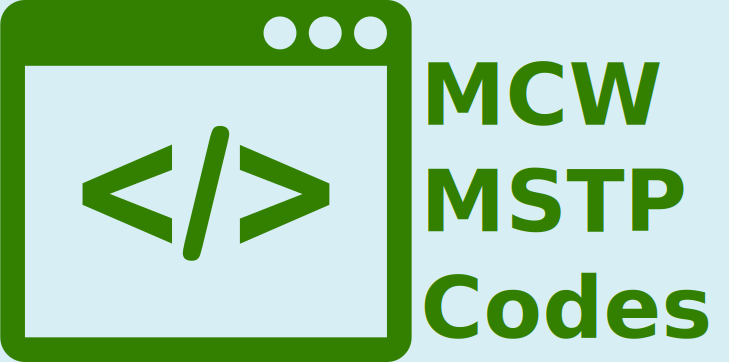

{align=center width=200px}

# Welcome to MSTP Codes :wave:

This is a website to share information and resources about mcw mstp. We are
currently taking suggestions for pages and information that you would like
be made available.

!!! warning
    This site is activly being updated and some layouts might
    change. 

This site was built using [mkdocs](https://www.mkdocs.org) and uses the [material]() theme.

## Layout

I was thinking that the primary pages could run accross the header. If you have any suggestions for topics, feel free to edit the site or shoot me an email (or since you are here, message me on the ABACUS slack channel)

## To-do

I was thinking it might be nice if people try the process of editing this site. Therefore it'd be great to have people get back to me about the process

- [x] Have people add their names to the site
    * [ ] Verify that 'contributing' instructions make sense
- [ ] Make central one-drive folder
- [ ] Add previous Abacus resources
- [ ] Maybe add survey results somewhere?
- [ ] Figure out where tutorials should go
- [ ] Make a logo
- [ ] Auto-build the website following merged pull requests

Feel free to give feedback <smazurchuk@mcw.edu>

